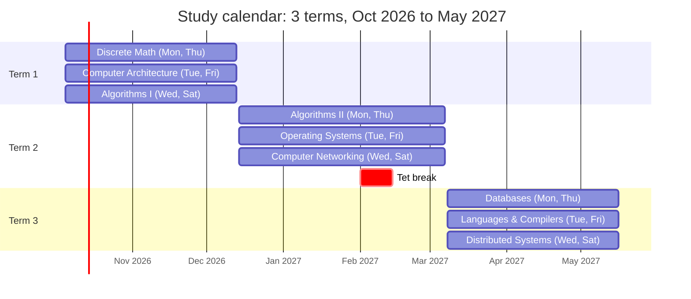

# CS Fundamentals Study Calendar

## Overview

Three 9-week terms take you from Oct 5, 2026 to May 16, 2027 (about 7.5 months), with three courses in parallel each term. Study runs every evening, 8:00–10:00 PM (14 hours a week): six class evenings plus a Sunday review and portfolio session. Every course ends with a public project that proves the skill.

**Weekly timetable**

| Evening, 8–10 PM | Session |
| --- | --- |
| Monday | Course A — lecture and reading |
| Tuesday | Course B — lecture and reading |
| Wednesday | Course C — lecture and reading |
| Thursday | Course A — exercise and project |
| Friday | Course B — exercise and project |
| Saturday | Course C — exercise and project |
| Sunday | Review and portfolio — catch up on anything missed, update project READMEs, write a short weekly log entry in the repo |

**Terms**

| Term | Dates | Mon & Thu | Tue & Fri | Wed & Sat |
| --- | --- | --- | --- | --- |
| 1 | Oct 5 – Dec 13, 2026 | Discrete Math | Computer Architecture | Algorithms I |
| 2 | Dec 14, 2026 – Mar 7, 2027 | Algorithms II | Operating Systems (with C) | Computer Networking |
| 3 | Mar 8 – May 16, 2027 | Databases | Languages & Compilers | Distributed Systems |

**Languages**

Each course uses the language its university version uses, so the assignments and autograders work as intended. Go and C++ are new: those courses start with a one-week ramp-up.

| Course | Language | University source |
| --- | --- | --- |
| Discrete Math | Python + LaTeX | MIT (Python in intro courses, LaTeX for proofs) |
| Computer Architecture | Nand2Tetris HDL + Python | Hebrew University / Nand2Tetris |
| Algorithms I & II | Java | Princeton (COS 226) |
| Operating Systems | C | Wisconsin (OSTEP), Berkeley CS162 |
| Computer Networking | C | CMU, Berkeley (sockets API) |
| Databases | SQL + C++ | CMU 15-445 (BusTub) |
| Languages & Compilers | Java | Crafting Interpreters (jlox) |
| Distributed Systems | Go | MIT 6.5840 |

Each term has 9 teaching weeks and a review week; Term 2 pauses for Tet (Feb 1–14, 2027). The plan fits 7.5 months by cutting depth, not subjects (about 324 hours instead of 475): C is taught inside Operating Systems, DDIA is read selectively, and compilers stop at a tree-walk interpreter. With only five evenings a week, expect about 9 months.

Each term plan lists its courses' videos, books, and practice tools. For curriculum maps covering the same ground, see [Teach Yourself CS](https://teachyourselfcs.com) and [OSSU](https://github.com/ossu/computer-science).

## Proof of work

Use two repos. Most university courses (Nand2Tetris, Princeton, CMU 15-445, MIT 6.5840) ask students not to publish assignment solutions, so their code stays private and the proof is the autograder score plus a public write-up. Your own projects go in the public repo.

**Setup (Week 1, one evening)**

- [ ] Public repo `cs-fundamentals`: your own projects, write-ups, and `LOG.md`
- [ ] Private repo `cs-coursework`: assignment code for courses that forbid publishing
- [ ] CI on both: pytest (Python), Gradle + JUnit (Java), `make test` + valgrind (C), CTest (C++), `go test` (Go)
- [ ] Root README with a progress table: each course, its score or demo, and a link to its write-up
- [ ] Commit every study evening; add a `LOG.md` entry every Sunday

**A course is done when**

- [ ] Its tests or autograder pass, with a screenshot of the score saved in the public repo
- [ ] Its write-up covers what you built, how it works, and what you learned (one page max, no solution code)

| # | Course | Project | Language | Visibility | Proof |
| --- | --- | --- | --- | --- | --- |
| 1 | Discrete Math | 20-proof notebook + logic evaluator | LaTeX, Python | Public | Proof PDF; pytest in CI |
| 2 | Computer Architecture | Hack computer + assembler (Nand2Tetris projects 1–6) | HDL, Python | Private | Course test scripts pass; optional Coursera certificate |
| 3 | Algorithms I | Princeton Part I assignments (Percolation to Kd-Trees) | Java | Private | Autograder scores |
| 4 | Algorithms II | Princeton Part II assignments + 60 LeetCode problems | Java | Private + public profile | Autograder scores; LeetCode profile |
| 5 | Operating Systems | Unix shell: pipes, redirects, background jobs | C | Public | Demo GIF; valgrind-clean CI |
| 6 | Computer Networking | Multithreaded HTTP/1.1 server on raw sockets | C | Public | `wrk` load-test results |
| 7 | Databases | BusTub: buffer pool manager and B+ tree index | C++ | Private | Gradescope scores |
| 8 | Languages & Compilers | jlox tree-walk interpreter | Java | Public | Passes the book's official test suite in CI |
| 9 | Distributed Systems | MIT 6.5840 labs: MapReduce, KV server, Raft leader election | Go | Private | Lab test output logs |

**Final (review week, May 10–16)**

- [ ] Portfolio page on GitHub Pages linking every write-up, score, and demo
- [ ] Capstone: a one-page design doc for a system you use at work, covering storage, replication, and failure modes

## Term 1 — Oct 5 to Dec 13, 2026

Discrete Math (Python), Computer Architecture (HDL, Python), and Algorithms I (Java). Evening-by-evening plan: [term-1-daily-plan.md](term-1-daily-plan.md)

## Term 2 — Dec 14, 2026 to Mar 7, 2027

Algorithms II (Java), Operating Systems (C), and Computer Networking (C). Evening-by-evening plan: [term-2-daily-plan.md](term-2-daily-plan.md)

## Term 3 — Mar 8 to May 16, 2027

Databases (SQL, C++), Languages & Compilers (Java), and Distributed Systems (Go). Evening-by-evening plan: [term-3-daily-plan.md](term-3-daily-plan.md)
